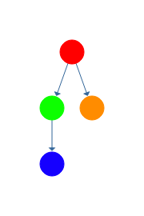
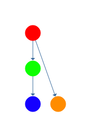
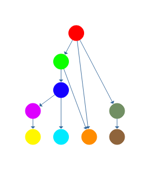

# heavy-tree-view

[](https://greenkeeper.io/)

[](https://standardjs.com) [](https://circleci.com/gh/cdaringe/heavy-tree-view/tree/master)

render a tree data structure with all nodes pulled to the bottom of the tree

## install

`npm install heavy-tree-view`

## usage

```js
var HeavyTreeView = require('heavy-tree-view')
var view = HeavyTreeView.parseTree(root)
console.log(view.toString())
// d5──┐
//     c5──┐
// b5------┤
//         a5
```

more examples of heavy trees [here](https://github.com/cdaringe/heavy-tree-view/blob/master/test/trees.js).

`root` is a simple tree node.  nodes are a simple data structure with the following interface:

```js
// provide `name` and `children` key value pairs
var b = { name: 'b', children: [] }
var a = { name: 'a', children: [b] }
```

## what is it, more precisely

it's a view of the tree, where all nodes get pulled down to the deepest level.

here's a traditional tree.



here's a tree with one of its leaves pulled down to the bottom (or height) of the tree.



why is this interesting?  because many trees represent things that race from their leaves, such as a task graph.  in the example of a task graph, all leaf tasks may kick off in parallel, and such a representation may more gracefully visualize the time dimension.  of course that example is imperfect (as tasks would not complete and proceed in lockstep), but it does demonstrate the priority run order more clearly.

here's a more complex example:



the two right-most leaves, and their parent(s) not including the root, are pulled down.

woo hoo! 🌲

## discussion

i'm not sure if there's an academic concept that maps to what i am defining as "heavy trees."  if there is, let me know!  given the lack of pragmatic use, i assume not, but `¯\_(academics)_/¯`.
